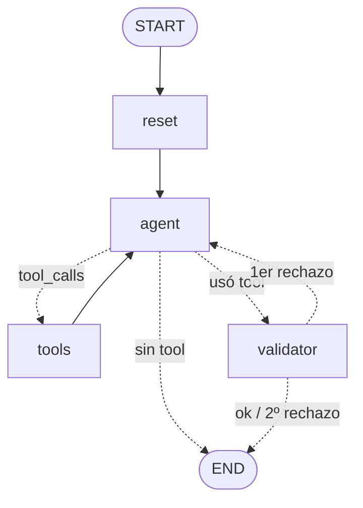

# Clase 2.5 — Agente RAG sobre los estados financieros de Abastible

Agente LangGraph con una tool de RAG (`buscar_estados_financieros`) sobre los estados financieros
consolidados de Abastible 2021–2025, con interfaz Streamlit y evaluación por **Tool Accuracy** y
**Answer Accuracy**. La especificación completa está en `CLAUDE.md`.

## Cómo ejecutar

```bash
pip install -r requirements.txt
# .env con OPENAI_API_KEY (y opcionalmente LangSmith)

python -m agent_app.ingest        # 1. construye vectorstore/abastible.json (una vez)
streamlit run app.py              # 2. pestañas "💬 Chat" (con trazabilidad) y "📊 Evaluación"
python -m evaluation.evaluate     # 3. (opcional) la misma evaluación desde la terminal
```

## Grafo



Las flechas continuas son aristas fijas y las punteadas, condicionales (`route_after_agent` y
`route_after_validator`).

- **State:** `messages`, `tool_used`, `tool_calls`, `retrieved_docs`, `validations`, `validator_feedback`.
- **reset:** limpia la trazabilidad del turno.
- **agent:** `gpt-4o-mini` con la tool enlazada decide si buscar o responder directo.
- **tools:** ejecuta la búsqueda (top-k = 10) y registra argumentos y documentos recuperados.
- **validator:** solo si se usó la tool. Verifica que cada cifra esté explícita en los chunks, en la
  fila del concepto y la columna del año (no un RUT ni un número de nota). Si no está respaldada,
  borra la respuesta y le da al agente un reintento; si vuelve a fallar, responde
  "No encontré esa información en los estados financieros."

Rutas típicas:

| Caso | Ruta |
|------|------|
| Saludo o definición | `START → reset → agent → END` |
| Pregunta RAG validada | `START → reset → agent → tools → agent → validator → END` |
| Rechazada una vez | `… → validator ✗ → agent → tools → agent → validator ✓ → END` |
| Rechazada dos veces | `… → validator ✗ → END` ("No encontré…") |

## Dataset (`evaluation/dataset.json`)

20 preguntas: 10 `rag` (deben usar la tool), 5 `no_tool` y 5 `falso_positivo` (parecen requerir
la tool pero no deben usarla). Las respuestas esperadas de `rag` están verificadas en `markdown/`.

## Métricas

- **Tool Accuracy:** % de preguntas donde los **nombres** de las tools llamadas coinciden con
  `expected_tools` (`[]` = no debía llamar ninguna).
- **Answer Accuracy:** % de respuestas correctas según un LLM-as-judge (`JUDGE_SYSTEM_PROMPT`).

Los resultados por corrida quedan en `evaluation/results/run_<timestamp>.json`.
